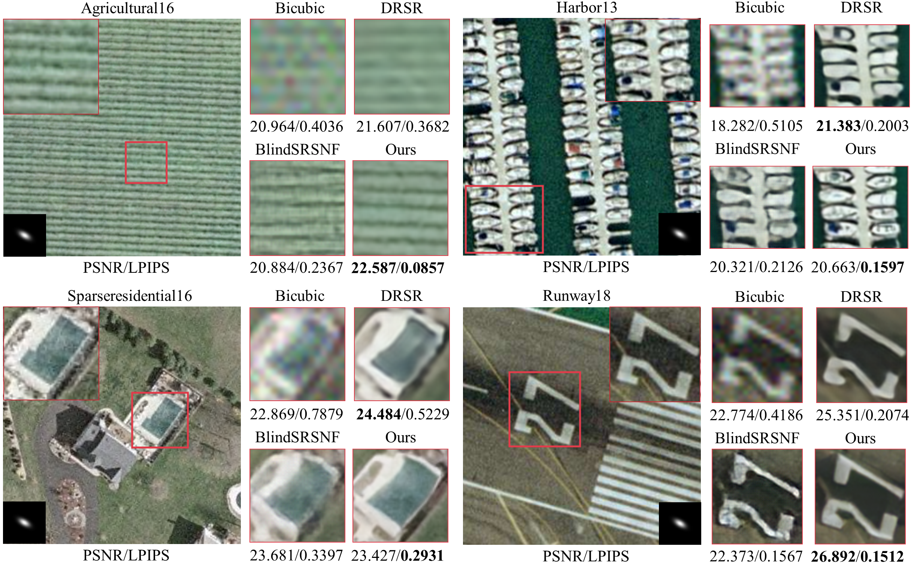
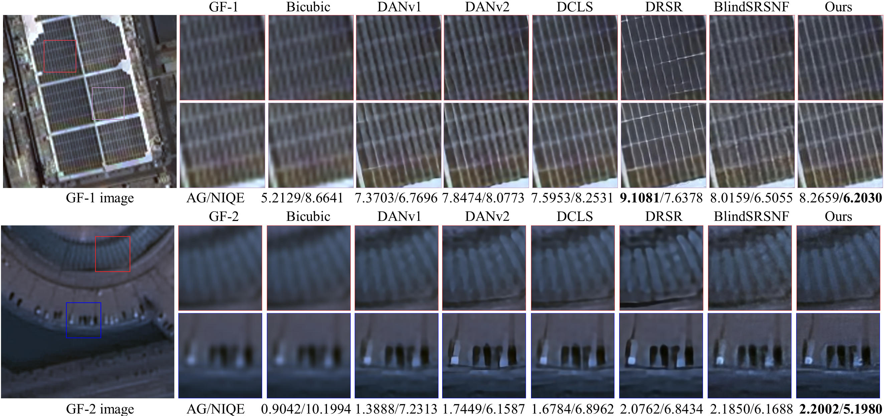

# DiffBSR
A method framework with degradation representation network and conditional Diffusion model for blind super-resolution of remote sensing image

## Folder Structure

Our folder structure is as follows:

```
├── DiffBSR (code)
│   ├── archs
│   │   ├── __init__.py
│   │   ├── common.py
│   │   ├── DiffSR_unet_arch.py
│   │   ├── degradation_encoder_arch.py
│   ├── configs
│   │   ├── DiffBSR_iso.yaml
│   │   ├── diffbsr_aniso.yaml
│   │   ├── diffbsr_aniso_UCM.yaml
│   ├── data
│   │   ├── __init__.py
│   │   ├── blindsr_JIF_datamodule.py
│   │   ├── rssr_datamodule.py
│   ├── litsr
│   │   ├── archs
│   │   |   ├── __init__.py
│   │   |   ├── rrdbnet_arch.py
│   │   |   ├── srdsran_arch.py
│   ├── load (dataset)
│   │   ├── train
│   │   ├── val
│   │   ├── AIRS_test
│   │   ├── WHU_test
│   │   ├── UCM_train
│   │   ├── UCM_val
│   │   ├── UCM_test
│   ├── models
│   │   ├── __init__.py
│   │   ├── blindSRSNF_model.py
│   │   ├── DiffBSR_model.py
│   ├── utils
│   │   ├── __init__.py
│   │   ├── srmd_degrade.py
│   ├── FID.py     (calculate fid metric separately)
│   ├── train.py
│   ├── test.py
│   ├── infer.py   (type == "LR_only")

│   ├── DCLS (DANv1,DANv2,DCLS model)
│   ├── DRSR (DRSR model)
│   ├── mfe_BuildFormer (building extraction BuildFormer model)
```

## Introduction

- DiffBSR (Diffusion model architecture): This project is based on [[BlindSRSNF]](https://github.com/hanlinwu/BlindSRSNF)

  - Contains six blind super-resolution models: ['DANv1', 'DANv2', 'DCLS', 'DRSR', 'BlindSRSNF', '**DiffBSR**']
  - BuildFormer: building extraction experiments for super-resolution results, this project is based on [[BuildFormer]](https://github.com/WangLibo1995/BuildFormer)


## Environment Installation

Our method uses python 3.8, pytorch 1.11, pytorch-lightning 1.5.5, other environments are in requirements.txt

```bash
pip install -r requirements.txt
```

## Dataset Preparation

We used three datasets to train our model. After secondary processing, we obtained a total of about 21,300 images of 256*256 size. 


- ["AIRS", "WHU Building", "UC Merced"]

- Link:   https://drive.google.com/drive/folders/1GnKXl9mJ05Nz6fUFLxziiMge6VDTJBBU?usp=sharing 

  

## Train & Evaluate

1. Prepare environment, datasets and code.
2. Run training / evaluation code. The code is for training on 1 GPU.

```bash
# DiffBSR
cd DiffBSR 
# train
python train.py --config configs/diffbsr_iso.yaml
python train.py --config configs/diffbsr_aniso.yaml
python train.py --config configs/diffbsr_aniso_UCM.yaml
# test
python test.py --checkpoint logs/diffbsr_iso/version_0/checkpoints/epoch=399-step=799999.ckpt
python test.py --checkpoint logs/diffbsr_aniso/version_0/checkpoints/epoch=399-step=799999.ckpt
python test.py --checkpoint logs/diffbsr_aniso_UCM/version_0/checkpoints/epoch=399-step=799999.ckpt
# infer
python infer.py --checkpoint logs/your_checkpoint_path

# BlindSRSNF (the same as above)
---------------------------------------------------------------
# DANv1,DANv2,DCLS:
# DANv1
cd DiffBSR/DCLS/codes/config/DANv1
# train
python3 train.py -opt=options/setting1/train_setting1_x4.yml  # iso
python3 train.py -opt=options/setting2/train_setting2_x4.yml  # aniso
# test
python3 test.py -opt=options/setting1/test_setting1_x4.yml    # iso
python3 test.py -opt=options/setting2/test_setting2_x4.yml    # aniso
# infer
python inference.py -opt=options/setting1/test_setting1_x4.yml/-opt=options/setting2/test_setting2_x4.yml

# DANv2,DCLS (the same as above)
---------------------------------------------------------------
# DRSR:
cd DiffBSR/DRSR
# train
python main.py
# test
python eval.py
# infer
python infer.py
---------------------------------------------------------------
# BuildFormer 
cd DiffBSR/BuildFormer
# train
python mfe_BuildFormer/train_supervision.py -c mfe_BuildFormer/config/whubuilding/buildformer.py
# test
python mfe_BuildFormer/building_seg_test.py -c mfe_BuildFormer/config/whubuilding/buildformer.py -o fig_results/whubuilding/buildformer --rgb -t 'lr'
```

## Results

### 1. Comparisons With The State-of-the-Art Methods


**Fig. 5.** Visual comparisons of experiments on AIRS dataset.


**Fig. 6.** Visual comparisons of experiments on WHU Building dataset.




**Fig. 7.** Visual comparisons of experiments on UC Merced dataset. Here we show four typical scenes.


### 2.  Building Extraction Evaluation of SR Results


**Fig. 8.** Visualization comparison of buildings extracted from SR results of different methods. (a) and (b) are from the AIRS dataset. (c) and (d) are from the WHU Building dataset.


### 3. Evaluation on Real-world Chinese Gaofen Multispectral Data



**Fig. 9.** Comparison of six methods for 4x super-resolution on real-world RS images. (a) GF-1 satellite image. (b) GF-2 satellite image. Smaller NIQE and higher AG imply better super-resolution results.
