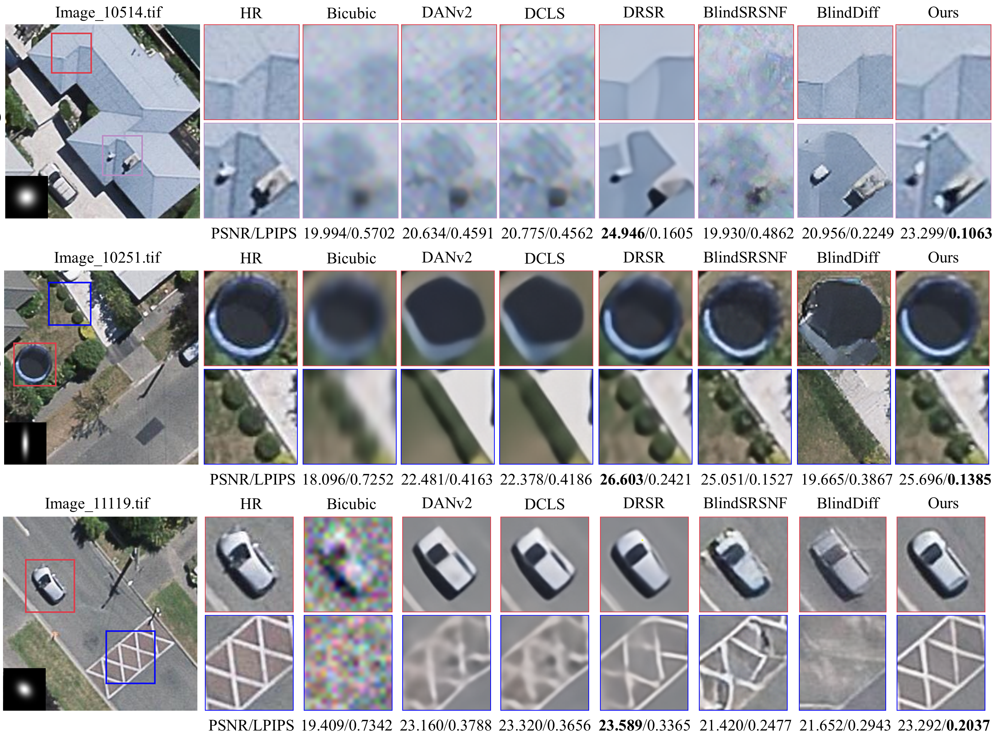

# **DiffBSR**
**Remote Sensing Image Blind Super-Resolution via a Convolutional Neural Network-Guided Conditional Diffusion Model**

  - Fanen Meng, Sensen Wu, Laifu Zhang, Haoyu Jing, Yijun Chen, Yiming Yan, Tian Feng, Renyi Liu, Zhenhong Du
  - *IEEE Journal of Selected Topics in Applied Earth Observations and Remote Sensing*, vol. 62, pp. 1-22
  - https://ieeexplore.ieee.org/document/10375518
  - checkpoint: https://pan.baidu.com/s/1s2Is4QxwYDPSIPHxELETUg?pwd=1234 or https://drive.google.com/drive/folders/1_ncUya30a-AwaDXkys56AMj2m8eSJjfH?usp=sharing


Fig. 1. Flowchart of the proposed method. Our condition Diffusion model contains a forward diffusion process which gradually adds noise to the HR image. And a convolutional neural network-guided end-to-end reverse generation process is applied to generate an accurate SR image corresponding to the LR image. 


## Folder Structure

Our folder structure is as follows:

```
├── DiffBSR (code)
│   ├── archs
│   │   ├── __init__.py
│   │   ├── common.py
│   │   ├── DiffSR_unet_arch.py
│   │   ├── degradation_encoder_arch.py
│   │   ├── sr3_vanilla_unet_arch.py
│   ├── configs
│   │   ├── diffbsr_iso.yaml
│   │   ├── diffbsr_aniso.yaml
│   │   ├── diffbsr_aniso_UCM.yaml
│   ├── data
│   │   ├── __init__.py
│   │   ├── blindsr_JIF_datamodule.py
│   │   ├── rssr_datamodule.py
│   ├── litsr
│   │   ├── archs
│   │   |   ├── __init__.py
│   │   |   ├── rrdbnet_arch.py
│   │   |   ├── srdsran_arch.py
│   ├── load (dataset)
│   │   ├── train
│   │   ├── val
│   │   ├── AIRS_test
│   │   ├── WHU_test
│   │   ├── UCM_train
│   │   ├── UCM_val
│   │   ├── UCM_test
│   ├── models (BlindSRSNF, SR3, DiffBSR model)
│   │   ├── __init__.py
│   │   ├── blindSRSNF_model.py
│   │   ├── DiffBSR_model.py
│   │   ├── sr3_vanilla_model.py
│   ├── utils
│   │   ├── __init__.py
│   │   ├── srmd_degrade.py
│   ├── FID.py     (calculate fid metric separately)
│   ├── train.py
│   ├── test.py
│   ├── infer.py   (type == "LR_only")
│   ├── DCLS (DANv2, DCLS model)
│   ├── DRSR (DRSR model)
```

## Introduction

- DiffBSR (Diffusion model architecture): This project is based on [[BlindSRSNF]](https://github.com/hanlinwu/BlindSRSNF)

  - Contains six blind super-resolution models: ['DANv2', 'DCLS', 'DRSR', 'BlindSRSNF', 'BlindDiff', '**DiffBSR**']


## Environment Installation

Our method uses python 3.8, pytorch 1.11, pytorch-lightning 1.5.5, other environments are in requirements.txt

```bash
pip install -r requirements.txt
```

## Dataset Preparation

We used three datasets to train our model. After secondary processing, we obtained a total of about 21,300 images of 256*256 size. 


- ["AIRS", "WHU Building", "UC Merced"]

- Link:   https://drive.google.com/drive/folders/1GnKXl9mJ05Nz6fUFLxziiMge6VDTJBBU?usp=sharing 

  

## Train & Evaluate

1. Prepare environment, datasets and code.
2. Run training / evaluation code. The code is for training on 1 GPU.

```bash
# DiffBSR
cd DiffBSR 
# train
python train.py --config configs/diffbsr_iso.yaml
python train.py --config configs/diffbsr_aniso.yaml
python train.py --config configs/diffbsr_aniso_UCM.yaml
# test
python test.py --checkpoint logs/diffbsr_iso/version_0/checkpoints/epoch=399-step=799999.ckpt
python test.py --checkpoint logs/diffbsr_aniso/version_0/checkpoints/epoch=399-step=799999.ckpt
python test.py --checkpoint logs/diffbsr_aniso_UCM/version_0/checkpoints/epoch=399-step=799999.ckpt
# infer
python infer.py --checkpoint logs/your_checkpoint_path

# BlindSRSNF, SR3 (the same as above)
---------------------------------------------------------------
# DANv2, DCLS:
# DANv2
cd DiffBSR/DCLS/codes/config/DANv2
# train
python3 train.py -opt=options/setting1/train_setting1_x4.yml  # iso
python3 train.py -opt=options/setting2/train_setting2_x4.yml  # aniso
# test
python3 test.py -opt=options/setting1/test_setting1_x4.yml    # iso
python3 test.py -opt=options/setting2/test_setting2_x4.yml    # aniso
# infer
python inference.py -opt=options/setting1/test_setting1_x4.yml/-opt=options/setting2/test_setting2_x4.yml

# DCLS (the same as above)
---------------------------------------------------------------
# DRSR:
cd DiffBSR/DRSR
# train
python main.py
# test
python eval.py
# infer
python infer.py

```


## Results

### 1. Comparisons With The State-of-the-Art Methods




**Fig. 5.** Visual comparisons of experiments on the AIRS dataset. Here we show three groups of degradations. 


**Fig. 6.** Visual comparisons of experiments on the WHU Building dataset. Here we show three groups of degradations.


**Fig. 7.** Visual comparisons of experiments on UC Merced dataset. Here we show four typical scenes.


**Fig. 8.** Visualization comparison of buildings extracted from SR results of different methods. (a) is from the AIRS dataset. (b) is from the WHU Building dataset. 

### 2. Evaluation on Real-world Chinese Gaofen Multispectral Data


**Fig. 9.** Comparison of six methods for 4x super-resolution on real-world RS images. (a) GF-1 satellite image. (b) GF-2 satellite image. Smaller NIQE and higher AG imply better super-resolution results.
